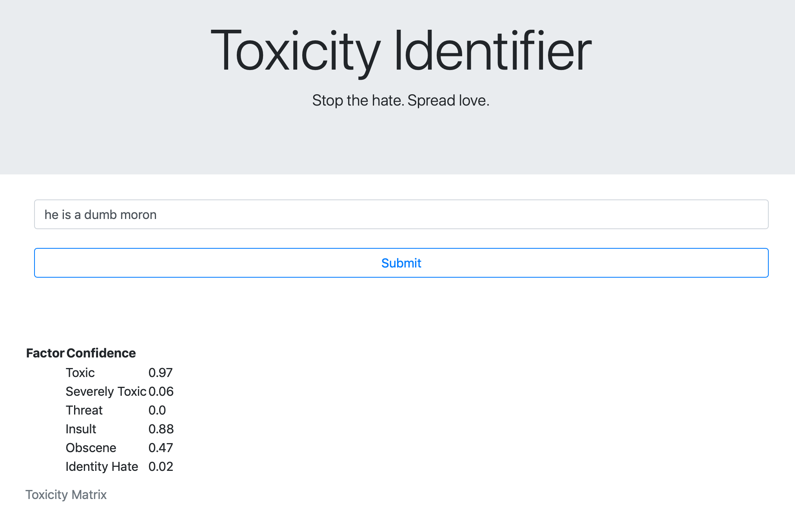

# Toxic Comment Classification Challenge

_Discussing things you care about can be difficult. The threat of abuse and harassment online means that many people stop expressing themselves and give up on seeking different opinions. Platforms struggle to effectively facilitate conversations, leading many communities to limit or completely shut down user comments._

It is necessary for platforms to use some kind of moderation before any comment is posted on the internet. Since the use of social media is on the rise everywhere, an effective approach to moderate the comments would be using Machine Learning to identify the toxicity of the comments entered.

With this thought in mind, I decided to use this dataset.

## Preprocessing

Since this is a Natural Language Processing task, a considerable amount of data preprocessing is required.

1. Remove numeric and empty texts
2. Cleaning unnecessary text
3. Tokenizing
4. Lemmatization
5. Sequence Creation

## Pretrained Word Vectors - _GloVe_

_`GloVe` is an unsupervised learning algorithm for obtaining vector representations for words. Training is performed on aggregated global word-word co-occurrence statistics from a corpus, and the resulting representations showcase interesting linear substructures of the word vector space._ - (Stanford NLP)

I used `GloVe`'s pre-trained word vectors.

## Model

NLP tasks require contextual understanding, thus making the use of `RNN`s/`GRU`s/`LSTM`s natural.

Also, recent developments in Deep Learning have shown that the use of `1-d CNN`s helps the feature understanding of the Neural Network.

I used a combination of GRU and CNN for this task. Here's the model architecture - 

Although the architecture might seem simple, it is extremely complex and *huge* to train.

## Model Performance

The model performed pretty well on the training data with an accuracy of **98%**. However, due to the regularization introduced, the validation accuracy is also **98%**.

Thus, the model is not overfitting to the training data.

_Since the training of this model is a huge task, I was not able to get the graphs of the accuracy and loss. However, will train the model again and upload the graphs._

#### The model has achieved an accuracy of 98.2% on the test data - which puts this model in the top 20 scores of Kaggle. 

## Model Deployment

Only training a model is not enough, it has to be deployed so that people can use it.

I've used _Flask_ to build a small UI (work in progress) to deploy this model.

The model is containerized with Docker and deployed on Microsoft Azure.

The API has been designed to accept `GET` and `POST` requests so that it is easily accessible from everywhere.

**The inference time is less than 20ms making this model extremely quick to determine the factors of toxicity in the text.**

## Snapshots

#### Positive Speech

#### Negative Speech

